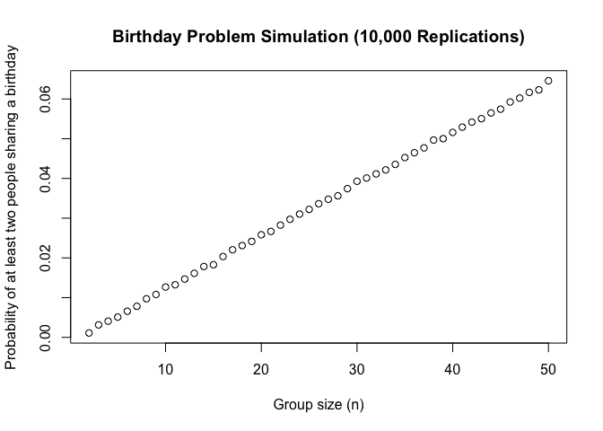
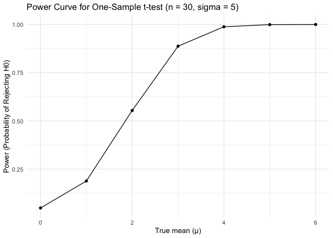
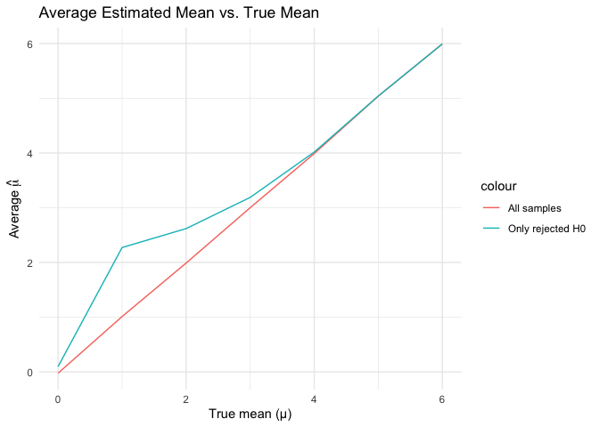

p8105_hw5_xc2784
================
2025-11-14

### problem 1

``` r
duplicate_birthday <- function(n, days = 365) {
  birthdays <- sample.int(days, n, replace = TRUE)
  any(duplicated(birthdays))
}
```

``` r
sim_prob <- function(n, reps = 10000L) {
  mean(replicate(reps, duplicate_birthday(n)))
}

group_sizes <- 2:50
prob_shared <- sapply(group_sizes, sim_prob)

plot(group_sizes, prob_shared,
     xlab = "Group size (n)",
     ylab = "Probability of at least two people sharing a birthday",
     main = "Birthday Simulation (10,000 Replications)")
```

<!-- --> The
plot shows the probability that at least two people in a group share a
birthday as the group size increases from 2 to 50. The curve starts near
zero for very small groups and rises slowly at first, but then increases
rapidly between group sizes of about 15 to 30, and approaches 1 when the
group size grows to about 50.

### problem 2

``` r
set.seed(10)
n <- 30
sigma <- 5
mu_values <- 0:6
reps <- 5000L
alpha <- 0.05
```

``` r
simulate1 <- function(mu, n, sigma) {
    x <- rnorm(n, mean = mu, sd = sigma)
    test <- t.test(x, mu = 0)
    tibble(
    mu      = mu,
    mu_hat  = mean(x),
    p_value = tidy(test)$p.value
  )
}

simulation_results <- mu_values %>%  
  map_df(~ bind_rows(replicate(reps, simulate1(.x, n, sigma), simplify = FALSE))
)

dplyr::glimpse(simulation_results)
```

    ## Rows: 35,000
    ## Columns: 3
    ## $ mu      <int> 0, 0, 0, 0, 0, 0, 0, 0, 0, 0, 0, 0, 0, 0, 0, 0, 0, 0, 0, 0, 0,…
    ## $ mu_hat  <dbl> -1.72338223, -0.56433529, -0.06373376, 0.82176074, -0.54577899…
    ## $ p_value <dbl> 0.03769650, 0.51941790, 0.94476785, 0.33832357, 0.55589101, 0.…

``` r
summary_results <- simulation_results %>%
  mutate(reject = p_value < alpha) %>% 
  group_by(mu) %>%
  summarise(
    power = mean(reject),
    avg_mu_hat = mean(mu_hat),
    avg_mu_hat_reject = mean(mu_hat[reject])
  )

dplyr::glimpse(summary_results)
```

    ## Rows: 7
    ## Columns: 4
    ## $ mu                <int> 0, 1, 2, 3, 4, 5, 6
    ## $ power             <dbl> 0.0484, 0.1884, 0.5542, 0.8876, 0.9882, 0.9994, 1.00…
    ## $ avg_mu_hat        <dbl> -0.02322427, 1.01178046, 1.98914725, 2.99978138, 3.9…
    ## $ avg_mu_hat_reject <dbl> 0.09830947, 2.27241568, 2.61868664, 3.18812983, 4.01…

``` r
ggplot(summary_results, aes(x = mu, y = power)) +
  geom_line() +
  geom_point() +
  labs(
    title = "Power Curve for One-Sample t-test (n = 30, 𝜎=5)",
    x = "True mean (μ)",
    y = "Power (Probability of Rejecting H0)"
  ) +
  theme_minimal()
```

<!-- -->
There is a positive association between effect size and power, that
larger true effects are easier to detect.

``` r
ggplot(summary_results, aes(x = mu)) +
  geom_line(aes(y = avg_mu_hat, color = "All samples")) +
  geom_line(aes(y = avg_mu_hat_reject, color = "Only rejected H0")) +
  labs(
    title = "Average Estimated Mean vs. True Mean",
    x = "True mean (μ)",
    y = expression(Average~hat(mu))
  ) +
  theme_minimal()
```

<!-- --> No,
the sample average of 𝜇̂ across tests for which the null is rejected is
not approximately equal to the true value of 𝜇, especially for smaller
effect sizes. When we only look at the cases that achieved statistical
significance, we’re essentially selecting the samples where random
variation happened to make the estimated mean unusually large. This
selective process causes the average estimate to be biased upward
compared to the true mean. As the true mean increases and the test gains
more power, nearly all samples become significant, and this bias become
smaller.
